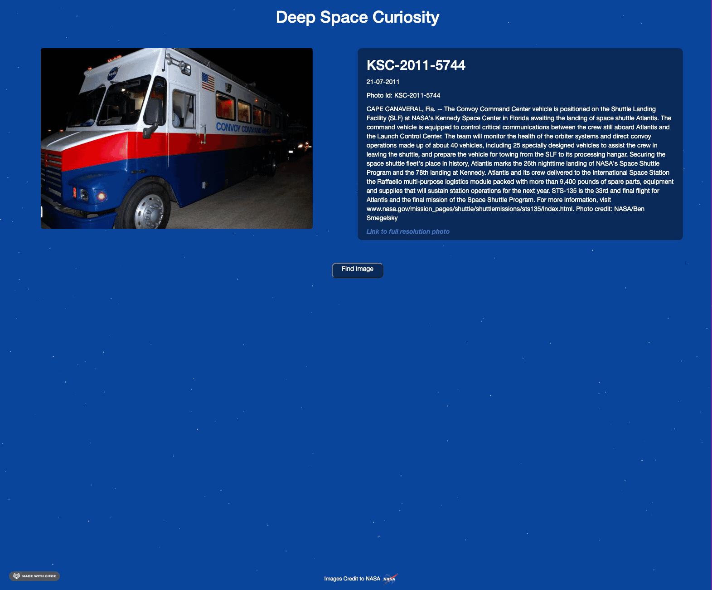

# Deep Space Curiosity

Using NASA's Image Archive API, this tool will load in a single image from their archive at a time, along with its description, title and other relevant information.
I've layered this all on top of _Vincent Garreau's [particles.js](https://github.com/VincentGarreau/particles.js/)_ for a subtle but neat star-like effect, to make the page seem a bit more active.

### Why

I have already built one app that uses an API, however I mostly followed someone else's javascript to complete that project, this time round I managed to complete the project myself.

Also space & science are pretty darn cool.

### Preview

### Notes

Edit:
* Updated it to search through the full 100 page image archive
* Added a button to find new images, still need to pretty it up though.

Idea's for future changes:
* Make the page reload itself every 30 seconds.
* Allow for videos & audio as well.